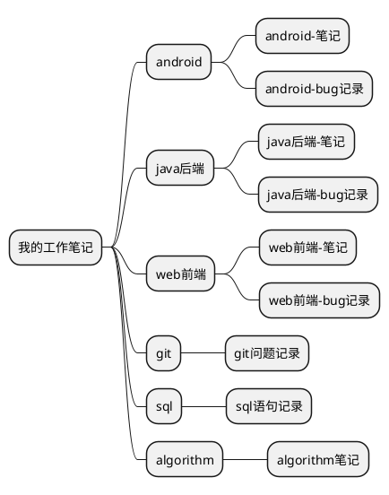

# MyNotes 我的工作笔记

```plantuml
@startmindmap
* 我的工作笔记
** android
*** android-笔记
*** android-bug记录
** java后端
*** java后端-笔记
*** java后端-bug记录
** web前端
*** web前端-笔记
*** web前端-bug记录
** git
*** git问题记录
** sql
*** sql语句记录
** algorithm
*** algorithm笔记
@endmindmap
```
